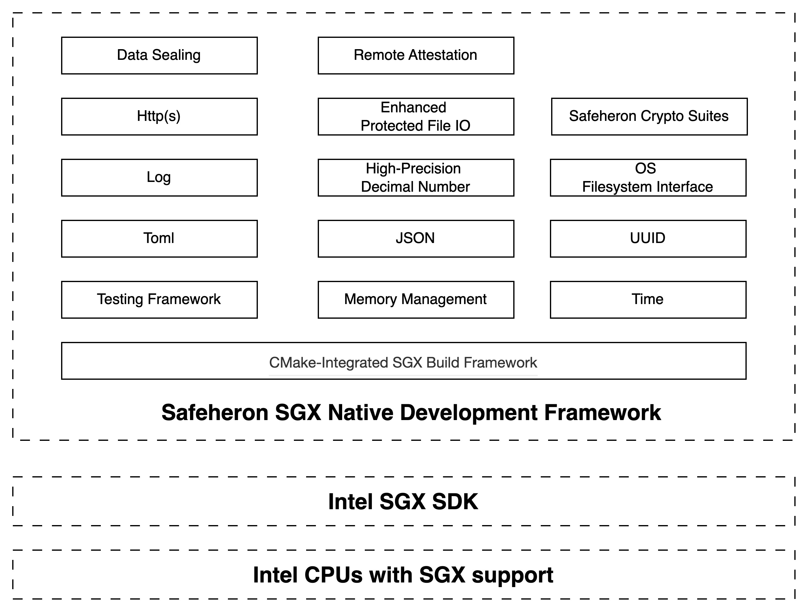

# SSGX - Safeheron SGX Native Development Framework

# Introduction
SSGX is a native development framework that leverages the hardware-enforced security guarantees of Intel SGX CPUs to 
enable trusted execution for sensitive applications.



It is built on top of the Intel SGX SDK and is designed to reduce the complexity of SGX TEE development in blockchain 
and other emerging fields while enhancing development efficiency and security. The framework provides comprehensive 
optimizations in the build system, system modules, functionality extensions, testing support, secure storage, interface 
simplification, and cryptographic support—addressing multiple pain points in SGX development. 

Key features of SSGX can be found in the documentation file [features.md](./features.md).

---

# Environment Requirements

This project is built based on the **SGX SDK** and **installation images**. Please ensure your environment meets the
following requirements:

- **Operating System**: Ubuntu 20.04 / 22.04
- **Build Tools**: `CMake (>=3.19)`, `GCC (>=9.3.0)`, or `Clang`
- **Ninja**: It is recommended to use Ninja as an alternative to Make.
- [**Install the Intel SGX SDK & PSW**](https://github.com/intel/linux-sgx)
- [**Install the Intel(R) SGX DCAP driver**](https://download.01.org/intel-sgx/latest/dcap-latest/linux/docs/Intel_SGX_SW_Installation_Guide_for_Linux.pdf)

> **Note:** The PCCS can be configured using a configuration file, default.json, located in the ‘config’ subdirectory 
> under the PCCS installation directory, referring to [configure_pccs.md](./configure_pccs.md).

---

# **Prerequisite Dependencies**

## **External Dependencies**

This project relies on the following third-party libraries:

- [`log4cplus`](https://github.com/log4cplus/log4cplus) - Logging library
- [`mbedtls-SGX`](https://github.com/Safeheron/mbedtls-SGX) - Lightweight cryptographic library
- [`mpdecimal`](./external/mpdecimal) - High-precision computation library
- [`nlohmann`](./external/nlohmann) - JSON parsing library
- [`toml11`](https://github.com/ToruNiina/toml11) - TOML configuration parsing library
- [`poco`](./external/poco) - Portable Components C++ Libraries
- [`protobuf`](./external/protobuf/) - Google's data interchange format
- [`safeheron-crypto-suites-cpp`](https://github.com/Safeheron/safeheron-crypto-suites-cpp) - Safeheron cryptographic algorithm library

## **Dependency Installation**

We provide a script to install all external dependencies automatically. The default installation path is 
`/opt/safeheron/ssgx`.

```shell
sudo chmod a+x build_install_external.sh
sudo ./build_install_external.sh
```

> **Note:**
> If build_install_external.sh fails to execute, check if chmod +x permission is set correctly.
> Ensure you have sudo privileges; otherwise, run the installation as a root user.

# Build and Install

- Configure the Compilation Process for ssgx

```shell
cmake --preset release-ssgx-config
```

- Compile ssgx

```shell
cmake --build --preset release-ssgx-build --verbose
```

Generates library files.

- Install ssgx
  The default installation path is /opt/safeheron/ssgx:

```shell
sudo cmake --install release-ssgx-config
```

## Running Tests

- Configure the Testing Environment

```shell
cmake --preset release-test-config
```

- Compile Test Cases

```shell
cmake --build --preset release-test-build --verbose
```

- Run Tests
  Execute basic tests:

```shell
ctest -R "basic_test" --preset release-unit-tests -V
ctest -R "http_test" --preset release-unit-tests -V
```

Parameter Explanation:

- -R "basic_test": Runs only the tests related to basic_test.
- --preset release-unit-tests: Uses the release preset.
- -V: Displays detailed test output.

# Development Process & Contact
This repository is maintained by Safeheron. Contributions are highly welcomed! Besides GitHub issues and PRs, feel free to reach out by mail.
